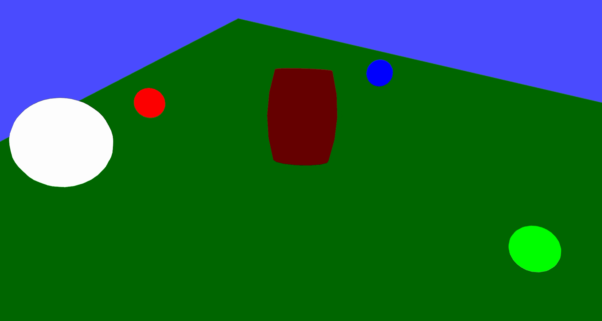
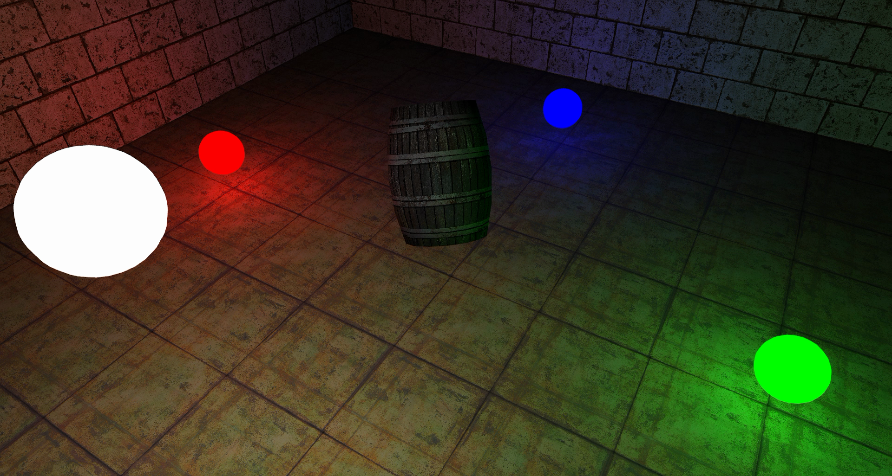
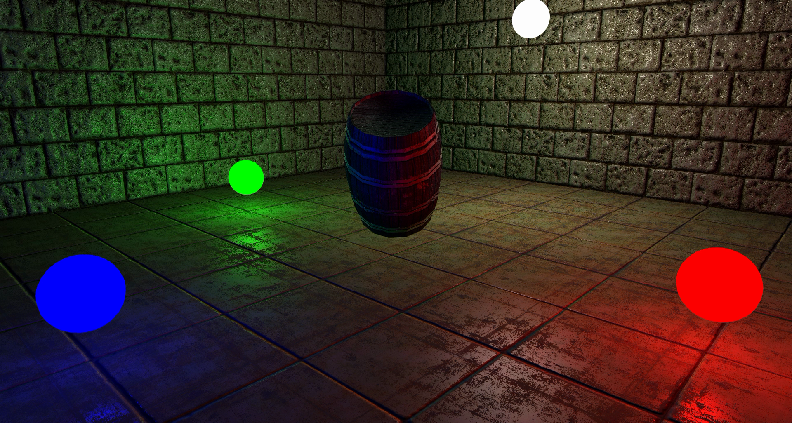

# Lighting demo

This is a simple demo of lighting that i have implemented so far.
An executable is located in the demo-bin folder.
This is compiled for windows and should run on most systems with opengl 3+.

## textures and models:

* https://opengameart.org/content/pietextureset

* https://opengameart.org/content/wood-barrels-pack

# Controls

|    input:   |         action:         |
|:-----------:|:-----------------------:|
|    mouse    |       orbit camera      |
|    w-key    |       move forward      |
|    s-key    |        move back        |
| '[' and ']' | iterate through shaders |

# preview

flat:

with texture:

with lighting:

with normal maps:

with specular maps:

